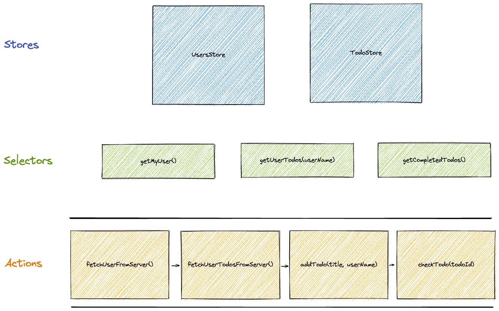

# connvy
**💽 CRUD for the frontend**

- [Getting Started](#getting-started)
  * [Setup your App](#setup-your-app)
  * [Creating a Store](#creating-a-store)
  * [Introducing Selectors](#introducing-selectors)
  * [Performing Actions](#performing-actions)
- [API](#api)
  * [Stores](#stores)
    + [Schemas](#schemas)
    + [Store Operations (CRUD)](#store-operations--crud-)
    + [Multiple Stores](#multiple-stores)
  * [Selectors](#selectors)
    + [Handling Selection Errors](#handling-selection-errors)
  * [Actions](#actions)
    + [Async Actions](#async-actions)
    + [Hooking into Action State](#hooking-into-action-state)
    + [Actions Linearity](#actions-linearity)
    + [Canceling Actions](#canceling-actions)
    + [Handling Errors](#handling-errors)

Connvy is a state management framework that aims to solve three main challenges with state management:
1. Make management of state and data collection simple using simple CRUD methods (using stores)
2. Make complex querying of data simple and efficient (using selectors)
3. Make state mutation reasonable and easy to follow (using actions)

It does so by wrapping your state in **stores** that provide CRUD operations over it with zero boilerplate. Your application may have as many stores as you need, for as many entities as you manage.

You can then hook into that state directly from your components, or better even: write domain logic for getters and setters and access your data through them.

Using **selectors**, your react application can hook into slices of the data from one or more stores, as well as memoize them.

Using **actions**, you can streamline the flow of your applications. Actions can be both sync and async, are atomic, and have good order over them (no race conditions, only one action at a time).



## Getting Started
In this quick guide, we'll learn how to write an app using connvy in three simple steps:
1. How to easily create state stores and use them naively (with next to zero boilerplate!) - 3 mins
2. How to create more complex selection logic ("getters") - 3 mins
3. How to create actions that take care of: state mutation, order of execution and async operations ("setters") - 5 mins

### Setup your App
First of all, install connvy by running the following command:
```sh
npm install connvy
```

Alternatively, using yarn:
```sh
yarn add connvy
```

The next thing you would need to do in order to set up, is to add the connvy provider to your App component:

*App.jsx**
```jsx
import { ConnvyProvider } from 'connvy';

export default function App() {
  return (
    <ConnvyProvider>
      ...
    </ConnvyProvider>
  );
}
```

Now that we're all set up, let's see how we can add basic state to our React app in two minutes:

### Creating a Store
In connvy, stores are containers for collections of data.

You create a new store by defining the schema of the internal collection:

*stores/todos.js*
```js
import { createStore } from 'connvy';

export const todoStore = createStore('todos', {
  schema: ($) => ({
    title: $.string(),
    isChecked: $.boolean(),
  })
});
```

And... We're done! Now, all we have to do in order to use this store, is to hook into it from our component:

*components/TodoList.jsx*
```jsx
import { useStore } from 'connvy';
import { todoStore } from '../stores/todo';

export function TodoList() {
  const todos = useStore(todoStore);

  return (
    <ul>
      {todos.list().map(todo =>
        <li key={todo.title}>{todo.title} (done: {todo.isChecked})</li>
      )}
    </ul>
  )
}
```

You can learn more about stores in the API chapter about [stores](#stores).

### Introducing Selectors
Now, let's say that we have a specific view, where we want to display data that is derived from our store according to a specific logic.

We could do that directly from our components; for instance, if we wanted to select all unchecked todos:

*components/UncheckedTodosSection.jsx*
```jsx
import { useStore } from 'connvy';
import { todoStore } from '../stores/todo';

export function UncheckedTodosSection() {
  const todos = useStore(todoStore);
  const uncheckedTodos = todos.listBy(todo => !todo.isChecked);

  return (
    <ul>
      {todos.list().map(uncheckedTodos =>
        <li key={todo.title}>{todo.title} (done: {todo.isChecked})</li>
      )}
    </ul>
  )
}
```

But what if we have more complex selections? Let's say that we have users that own todos, and we want to display all todos for a specific user. What would we do then?

We could embed the logic in our component:

*components/UserTodosSection.jsx*
```jsx
import { useStore } from 'connvy';
import { todoStore } from '../stores/todo';
import { userStore } from '../stores/user';

export function UserTodosSection({ userName }) {
  const todos = useStore(todoStore);
  const users = useStore(userStore);

  // first get the user entity by username
  const user = users.getBy(user => user.userName === userName);
  // then get all todos that are owned by the user, by their Id
  const userTodos = todos.listBy(todo => todo.userId === user.id);

  return (
    <ul>
      {todos.list().map(userTodos =>
        <li key={todo.title}>{todo.title} (done: {todo.isChecked})</li>
      )}
    </ul>
  )
}
```

But then we have three problems that jump right up:
1. We have to copy that logic to every component that might need this selection
2. We have to write the fallback logic on our own (what if the user was not found?)
3. The logic is being run with every render, regardless of whether or not the data has changed, which might impact performance at scale

In order to solve that, connvy has the concept of **Selectors**:

*selectors/listUserTodos.js*
```js
import { createSelector } from 'connvy';
import { todoStore } from '../stores/todo';
import { userStore } from '../stores/user';

export const listUserTodos = createSelector({ todoStore, userStore }, ({ todoStore, userStore }, userName) => {
  const user = userStore.getBy(user => user.userName === userName);
  const userTodos = todoStore.listBy(todo => todo.userId === user.id);
  return userTodos;
});
```

The selector has two main parameters:
1. The list of stores it depends on (passed as object) - in our case, `todoStore` and `userStore`
2. The function itself. It can accept any list of parameters you decide (in our case, `userName`), but the first parameter will always be the same stores that you depended upon.

And then use it in your component like that:
*components/UserTodosSection.jsx*
```jsx
import { useSelector } from 'connvy';
import { listUserTodos } from '../selectors/listUserTodos';

export function UserTodosSection({ userName }) {
  const [userTodos] = useSelector(listUserTodos(userName)); // not that userTodos is wrapped with brackets. this is intentional and we go over the reason in the API chapter about selectors

  return (
    <ul>
      {todos.list().map(userTodos =>
        <li key={todo.title}>{todo.title} (done: {todo.isChecked})</li>
      )}
    </ul>
  )
}
```

The `useSelector` hook runs upon render, and memoizes the result based on both the stores it depends on, and the input that was passed to it (in our case, userName). This means that the component will **not** rerender as long as the data hasn't changed.

You can learn more about stores in the API chapter about [selectors](#selectors).

### Performing Actions
Let's tackle the final challenge in every stateful application: mutation. As we learned, we can just naively use the default CRUD operations in our stores to change the state. But what if we wanted to have a more defined domain logic?

In connvy, we call these mutation **Actions**.

For instance, let's say that every new todo is unchecked by default. We can create an **action** to handle that:

*actions/createTodo.js*
```js
import { createAction } from 'connvy';
import { todoStore } from '../stores/todo';

export const createTodo = createAction('createTodo', { todoStore }, ({ todoStore }, title) => {
  todoStore.create({ title, isChecked: false  });
});
```

As with selectors, we use the `createAction` constructor, where:
1. The first parameter is the name of the action (we can see what it's used for soon)
2. The second is the stores it operates upon (same as we do with selectors)
3. The third is the implementation function, where again: it can accept any list of parameters you decide (in our case, `title`), but the first parameter will always be the stores you operate upon.

From now on, we can run `createTodo` from our code, using the `useAction` hook. For instance:

*components/UserTodosSection.jsx*
```jsx
...
import { useActions } from 'connvy';
import { createTodo } from '../actions/createTodo';

export function UserTodosSection({ userName }) {
  const actions = useActions();

  return (
    <div>
      <ul>
        ...
      </ul>
      <button onClick={() => actions.run(createTodo('My New Todo'))} >Add Todo</button>
    </div>
  )
}
```

That might seems like a huge boilerplate for such a simple action, and it might be; But what if we want to run a more complex action? That's where actions start to make sense:

Let's say, that when we create a todo, we want to assign it to the user:

*actions/createTodo.js*
```js
import { createAction } from 'connvy';
import { todoStore } from '../stores/todo';
import { userStore } from '../stores/user';

export const createTodo = createAction('createTodo', { todoStore, userStore }, ({ todoStore, userStore }, title, userName) => {
  const user = userStore.getBy(user => user.userName === userName);
  todoStore.create({ title, userId: user.id, isChecked: false });
});
```

Now, if we pass the username from our component, the action will take care of the more sophisticated logic

*components/UserTodosSection.jsx*
```jsx
...
import { createTodo } from '../actions/createTodo';

export function UserTodosSection({ userName }) {
  const actions = useActions();

  return (
    <div>
      <ul>
        ...
      </ul>
      <button onClick={() => actions.run(createTodo('My New Todo', userName))}>Add Todo</button>
    </div>
  )
}
```

You can learn more about actions in the API chapter about [actions](#actions).

## API

### Stores
Stores are the backbone of every connvy application. They manage collections of data, which you can easily read from, and write to, from components, selectors and actions:

```js
import { createStore } from 'connvy';

export const todoStore = createStore('todos', {
  schema: ($) => ({
    title: $.string(),
    isChecked: $.boolean(),
  })
});
```

Technically, once you have a store, you can hook into it and start working, using the `useStore` hook.

#### Schemas
As you can see, when you declare a store, you need to provide a schema. The schema is used both in runtime to validate data, and in compile time (if you are using Typescript).

The `schema` property receives a function, that received a schema builder (`$`) using the visitor pattern. We use `zod` for schema building, internally, and the provided API relies on it. Learn more about zod [here](https://github.com/colinhacks/zod).

#### Store Operations (CRUD)
Creating a store basically lets you write a complete naive application, since every store comes with select CRUD operations that allow you to easily read and write the data:
- Create
- Read (get, list)
- Update
- Delete

You can use them via the functions provided to you by the hook:

```js
const todos = useStore(todoStore);
todos.create({ title: 'my first todo!', isChecked: false }); // creates a new item in the collection

todos.list(); // returns an array containing all items in the store
todos.listBy(todo => todo.isChecked); // returns a filtered array containing only items that match the criteria

todos.get(0); // returns the first item in the store. throws if does not exist
todos.getBy(todo => todo.title.includes('first')); // returns the first item that matches the criteria. throws if does not exist

todos.update(0, { isChecked: true }); // updates the first item in the store. throws if does not exist
todos.updateAllWhere(todo => !todo.isChecked, { isChecked: true }); // updates all items that match the criteria. throws if does not exist

todos.delete(0); // deletes the first item in the store
todos.deleteAllWhere(todo => todo.isChecked) // deletes all items that match the criteria

todos.replace([{ title: 'my first todo!', isChecked: false }]); // replaces all existing data in the store with the provided array. highly destructive, but useful in case where you want to sync it to another source, such as the server
```

#### Multiple Stores
An application can have more than one store. Adding more stores is as simple as creating them and utilizing them via `useStore`:

```js
const todos = useStore(todoStore);
const tabs = useStore(tabs);
const users = useStore(users);
```

The API is simple so you won't have reservations about adding new stores when needed. But when should you add a new store?

This is up to you, but our rule of thumb is: connvy stores are equivalent to tables \ collections in a database.
Once a store becomes hard to maintain (complicated get \ update logic, big items) it might be a good time to consider splitting it up.

### Selectors
Selectors provide a way to read data in a more streamlined fashion: you depend on one or more stores, accept an input, and return an output containing the desired data. This model allows for three important things:

1. It provides an abstraction layer for more complex data selection flows
2. It allows for memoization, since you declare up-front which stores you depend on
3. It has a built-in mechanism for error handling when the selection has failed

*selectors/listUserTodos.js*
```js
import { createSelector } from 'connvy';
import { todoStore } from '../stores/todo';
import { userStore } from '../stores/user';

export const listUserTodos = createSelector({ todoStore, userStore }, ({ todoStore, userStore }, userName) => {
  const user = userStore.getBy(user => user.userName === userName);
  const userTodos = todoStore.listBy(todo => todo.userId === user.id);
  return userTodos;
});
```

You can then hook into your selectors using the `useSelector` hook:

```jsx
const [userTodos] = useSelector(listUserTodos); // returns UserTodo[] | null
const [userTodos, error] = useSelector(listUserTodos); // also get errors, if there were any
```

#### Handling Selection Errors
What if the selection fails? (e.g., no user was found for the given userName)?

We have two ways of handling errors. The first is to provide the selector with a fallback:

*selectors/listUserTodos.js*
```js
import { createSelector } from 'connvy';
import { todoStore } from '../stores/todo';
import { userStore } from '../stores/user';

export const listUserTodos = createSelector({ todoStore, userStore }, ({ todoStore, userStore }, userName) => {
  const user = userStore.getBy(user => user.userName === userName); // this can throw, if user was not found
  const userTodos = todoStore.listBy(todo => todo.userId === user.id);
  return userTodos;
}, { fallback: [] }); // so just return a fallback of an empty array if the user was not found!
```

As you can see, we provided `createSelector` with an optional third parameter, which contains a fallback value. What this means, is that if for some reason the selection has failed, an empty array is returned instead.

The second way to handle selection errors is to actually **let the selection fail**, and tap into the error in your component:

*components/UserTodosSection.jsx*
```jsx
import { useSelector } from 'connvy';
import { listUserTodos } from '../selectors/listUserTodos';

export function UserTodosSection({ userName }) {
  const [userTodos, error] = useSelector(userName);

  if (error) {
    return <p>Could not select user todos. Reason: {error}</p>; 
  }

  return (
    <ul>
      {todos.list().map(userTodos =>
        <li key={todo.title}>{todo.title} (done: {todo.isChecked})</li>
      )}
    </ul>
  );
}
```

### Actions
Actions are operations that apply mutation to one or more stores:

*actions/createTodo.js*
```js
import { createAction } from 'connvy';
import { todoStore } from '../stores/todo';

export const createTodo = createAction('createTodo', { todoStore }, ({ todoStore }, title) => {
  todoStore.create({ title, isChecked: false  });
});
```

Actions should be used for any mutation, from user interactions to data sync from server. Connvy can handle both sync and async actions, and promises that no two actions can interfere with one another.

In order to run an action, you need to hook into the `useActions` hook from your component, and use it to your desired action:

```js
import { useActions } from 'connvy';
import { createTodo } from '../actions/createTodo';

export function UserTodosSection({ userName }) {
  const actions = useActions();
  
  const onClick = () => {
    actions.run(createTodo('My New Todo'));
  }

  return (
    <div>
      <button onClick={onClick} >Add Todo</button>
    </div>
  )
}
```

#### Async Actions
Actions in connvy can be async, and that is **by design**. In order to make an action async, just provide an async function into the `createAction` factory:

*actions/fetchTodosFromServer.js*
```js
import { createAction } from 'connvy';
import { todoStore } from '../stores/todo';

export const fetchTodosFromServer = createAction('fetchTodosFromServer', { todoStore }, async ({ todoStore }) => {
  const todosFromServer = await fetch('/todos').then(res => res.json());
  todoStore.replace(todosFromServer);
});
```

Connvy knows that the action isn't finished until the async function is done running, and therefore any changes to the stores are applied only **once the action is done running**; Therefore, your components will only rerender once the action is done running (and not show "half states"). In addition, `actions.run` will return a promise that resolves once your action was finished, should you want to await upon it.

This also allows you to have peace of mind if your action is not atomic, as you will never have a situation where your component shows data from midpoint of an action.

#### State Isolation During Action Execution
While your action is running, connvy ensures complete state isolation over the affected stores. What does it mean?
1. Any changes you make to the stores is stored locally until the action has finished successfully
2. The stores are **locked for writing** outside of the action, meaning that no one else can `create`, `update` or `delete` any items in the affected store as long as your action is still ongoing (they will get an error)

This has two benefits:
1. Changes made to any of your stores while the action is still ongoing **are not reflected outside of it**, meaning that the stores are only updated once, after the action is done running
2. In case you cancel the action (read about canceling actions [here](#canceling-actions)), the state is not 

That said, there's one thing you need to keep in mind: if you have side effects, they still occur, even if the action is not done yet.
Things like requests, state updates, etc. - all of them will still occur immediately even if the action is still running.

#### Hooking into Action State
Async actions might take some time to complete, during which you might want to display some feedback to the user (for instance, a loader). You can do that by using a simple hook:

*components/UserTodosSection.jsx*
```jsx
...
import { useActions, useActionState } from 'connvy';
import { fetchTodosFromServer } from '../actions/fetchTodosFromServer';

export function UserTodosSection({ userName }) {
  const actions = useActions();
  const actionState = useActionState(fetchTodosFromServer);

  if (actionState.state === 'ONGOING') {
    return <p>Loading data from server...</p>
  }

  return (
    <div>
      <ul>
        ...
      </ul>
      <button onClick={() => actions.run(createTodo('My New Todo', userName))}>Add Todo</button>
    </div>
  )
}
```

There are three states for an action:
1. `IDLE` - action is not being run right now
2. `ONGOING` - action is currently ongoing
3. `ERROR` - action has returned error (read more about it in the *error handling* section)
3. `COMPLETED` - action was just run and completed

Additionally, you can use the hook to subscribe to any action in the app:

```js
useActionState(); // returns { actionName, state, error } for the latest action that was run in the system
useActionState(fetchTodosFromServer); // returns { actionName, state, error } for the requested action. If the requested action isn't the latest one that was run, it simply shows state = IDLE
useActionState([fetchTodosFromServer, sendTodosToServer]); // same as above, but for multiple actions instead of just one
```

#### Actions Linearity
Actions have a distinct property to them: only one action can be performed at any given time, either sync or async! This gives you three strong features:
1. No race conditions: you have a guarantee that any action, async or otherwise, can't be invoked as long as another action is in progress
2. As a result, you always have order of invocation (useful for debugging)
3. You can hook into action state at any given time from you components, if you want to act upon it (for instance, show a loader while an action is performed)

On your side, what this means is that invoking an action while another one is on way will result in an error:

```
OngoingActionError:
  cannot invoke action
    createTodo("My First Todo", "royso")
  as there is a currently ongoing action
    fetchTodosFromServer("royso")
  if you want the new action to take precedence, please cancel the ongoing one first
```

You can either handle this error or ignore it (see the "Handling Errors" section), or cancel the ongoing action to make way for the new one.

#### Canceling Actions
If you have an ongoing action in place, and you want to cancel it, you can do it directly by running the `cancel` function:

```js
import { useActions } from 'connvy';

const actions = useActions();
actions.cancel(); // cancels any ongoing action
actions.cancel(fetchTodosFromServer); // cancels the ongoing action only if it's fetchTodosFromServer
actions.cancel([createTodo, fetchTodosFromServer]); // cancels the ongoing action if it's either createTodo or fetchTodosFromServer
```

The `cancel` function can also be chained:

```js
import { useActions } from 'connvy';
import { createTodo } from '../actions/createTodo';

const actions = useActions();

actions.cancel().run(createTodo('My First Todo', 'royso'));
actions.cancel(fetchTodosFromServer).run(createTodo('My First Todo', 'royso'));
actions.cancel([createTodo, fetchTodosFromServer]).run(createTodo('My First Todo', 'royso'));
```

Final note about canceling actions: canceling isn't something that you should use too often, for two main reasons:
1. It makes the flow of events harder to follow
2. While state is not committed after a canceled action, other side-effects might not be reversed

The second point means that if your action has a side effect other than updating store state (e.g. save data to the server, update a react state or props), this side effect will not be "cancelled", which might create inconsistencies.

One way or another, in most cases, you don't need to use cancellation. If you run into many interfering actions, you might want to reconsider how they're built (for instance, consolidate actions that usually run together, or break down actions that take too long to complete). Resolving them via better design and definition is always preferable over canceling.

#### Handling Errors
Connvy automatically catches every error thrown within the action context (async actions as well). It then does two things:
1. Stores the action as "failed"
2. Rethrows the error

This means that you have two ways of handling errors:
1. Wrap your call to the action with `try { ... } catch` and act accordingly
2. Hook into the action state and display error

Let's see how we would handle errors by hooking into the error state:

```jsx
import { useActions, useActionState } from 'connvy';
import { fetchTodosFromServer } from '../actions/fetchTodosFromServer';

export function UserTodosSection({ userName }) {
  const actions = useActions();
  const actionState = useActionState(fetchTodosFromServer);

  if (actionState.state === 'ONGOING') {
    return <p>Loading data from server...</p>
  }

  if (actionState.state === 'ERROR') {
    return <p>Could not fetch todos from server. Reason: {actionState.error}</p>
  }

  return (
    <div>
      <ul>
        ...
      </ul>
      <button onClick={() => actions.run(createTodo('My New Todo', userName))}>Add Todo</button>
    </div>
  )
}
```
